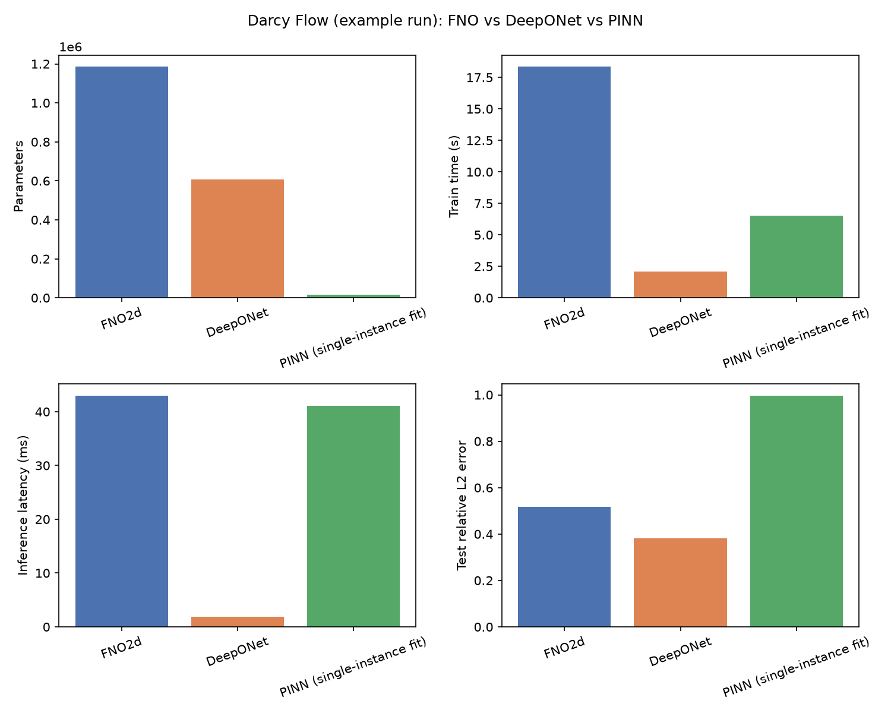
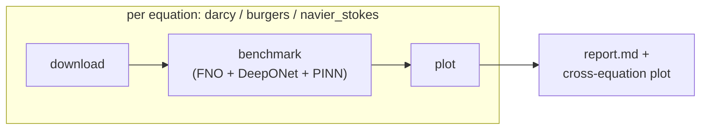

# FNO

<p align="center"><em>Fourier Neural Operator, DeepONet, and PINN -- implemented, tested, and benchmarked head-to-head on the same PDE data.</em></p>

<p align="center">
  <a href="https://www.python.org/"></a>
  <a href="https://pytorch.org/"></a>
  <a href="https://github.com/astral-sh/uv"></a>
  <a href="LICENSE"></a>
</p>

## Table of Contents

- [Executive Summary](#executive-summary)
- [Getting Started](#getting-started)
- [Project Layout](#project-layout)
- [Data](#data)
- [Models](#models)
- [Benchmark](#benchmark)
- [Pipeline](#pipeline)
- [Development](#development)
- [License](#license)

## Executive Summary

This repository implements and rigorously compares three operator-learning / PDE-solving architectures in PyTorch -- **Fourier Neural Operator (FNO)**, **DeepONet**, and **Physics-Informed Neural Networks (PINN)** -- on three benchmark PDEs from [PDEBench](https://github.com/pdebench/PDEBench): **Darcy Flow (2D)**, **Burgers' equation (1D)**, and **incompressible Navier-Stokes (2D)**.

Built as a Scientific Machine Learning benchmark (MVA / ENSTA Paris), the emphasis throughout is on **honest, verified results**: every model/equation combination is backed by a test against real downloaded data, super-resolution claims are checked against native high-resolution ground truth rather than synthetic upsampling, and PINN's fundamentally different (non-operator) setup is explicitly flagged everywhere it's compared to FNO/DeepONet instead of being silently averaged in.

### Highlights

- **Full 3x3 coverage** -- FNO, DeepONet, and PINN are all implemented and tested against all three equations (see the [coverage table](#models)).
- **Genuine zero-shot super-resolution** -- operators train at low resolution and are evaluated directly against PDEBench's native high-resolution ground truth, never synthetic/interpolated data.
- **One command, fully resumable** -- `fno-pipeline` runs download -> train -> evaluate -> benchmark -> plot end to end, and safely resumes after any interruption (see [Pipeline](#pipeline)).
- **Modern tooling** -- managed by [`uv`](https://github.com/astral-sh/uv) for fast, reproducible installs.

## Getting Started

Requires [`uv`](https://github.com/astral-sh/uv) (Python 3.12 is pinned via `.python-version` and fetched automatically if missing).

```bash
uv sync
```

This creates a `.venv` with all runtime and development dependencies (PyTorch, NumPy, SciPy, h5py, Matplotlib, Weights & Biases, pytest, ruff, ...) locked in `uv.lock`.

```bash
uv run fno-download pdebench-darcy2d      # grab a sample dataset
uv run fno-benchmark --equation darcy     # train + compare FNO / DeepONet / PINN
uv run fno-pipeline --run-dir runs/demo   # or: run everything end to end, resumably
```

## Project Layout

```
src/fno/
├── data/          download CLI, PyTorch Dataset classes, HDF5 inspector
├── models/        FNO1d / FNO2d, DeepONet, PINN architectures
├── training/      generic trainer (checkpoint/resume), collate adapters, PINN losses
├── benchmarks/    FNO vs DeepONet vs PINN comparison harness + plotting
└── pipeline.py    resumable end-to-end orchestrator (fno-pipeline)
tests/             one test file per module; real-data smoke tests where relevant
```

## Data

Benchmark datasets are fetched on demand via the `fno-download` CLI -- nothing downloads automatically, and everything it creates lives under a single `--data-root` folder (default `data/`) so it can be wiped with one `rm -rf`.

```bash
uv run fno-download --list                                   # available datasets and variants
uv run fno-download pdebench-darcy2d                          # 2D Darcy Flow sample (~1.2 GB)
uv run fno-download pdebench-burgers1d --variant nu0.01       # 1D Burgers sample
uv run fno-download pdebench-navierstokes2d --variant shard0  # 2D Navier-Stokes shard (~9.9 GB)
uv run fno-download airfrans                                  # 2D airfoil RANS CFD (~10 GB)
```

| Key | Source | Notes |
| --- | --- | --- |
| `pdebench-burgers1d` | [PDEBench](https://github.com/pdebench/PDEBench) | 12 viscosities (`--variant nu0.001` ... `nu4.0`) |
| `pdebench-darcy2d` | PDEBench | 5 diffusion coefficients (`--variant beta0.01` ... `beta100.0`) |
| `pdebench-navierstokes2d` | PDEBench | 5 curated shards out of ~275 (`--variant shard0` ... `shard4`) |
| `airfrans` | [AirfRANS](https://github.com/Extrality/AirfRANS) | irregular-geometry airfoil CFD, single archive |

Files are checksum-verified (MD5) against PDEBench's published hashes where available. Use `--variant` (repeatable) or `--all-variants` to pick which files to pull, and `--force` to re-download.

Before writing a loader for a new/unverified file format, inspect its real structure:

```bash
uv run fno-inspect-h5 data/raw/pdebench-navierstokes2d/ns_incom_inhom_2d_512-0.h5
```

### Loading data

`src/fno/data/pdebench.py` provides PyTorch `Dataset` classes for the three target equations, each validated against real downloaded files (schema confirmed via `fno-inspect-h5`, not just assumed from docs):

- `DarcyFlowDataset` -- permeability field (`nu`) -> steady-state pressure field (`tensor`)
- `Burgers1DDataset` -- initial timesteps -> full spatio-temporal trajectory
- `NavierStokes2DDataset` -- initial velocity frames -> full trajectory; accepts multiple shard paths (each shard only holds 4 trajectories) and concatenates them

```python
from fno.data.pdebench import DarcyFlowDataset

ds = DarcyFlowDataset("data/raw/pdebench-darcy2d/2D_DarcyFlow_beta1.0_Train.hdf5", split="train")
input_field, target_field, grid = ds[0]
```

All three accept `split="train"|"val"|"test"` and `split_fractions=(train, val, test)` (default `(0.8, 0.1, 0.1)`) -- validation is kept separate from the held-out test set specifically so hyperparameter tuning never touches test data.

## Models

Three operator-learning/PDE-solving architectures are implemented, mirroring the README's benchmark scope:

- **`fno.models.fno`** (`FNO1d`/`FNO2d`) -- spectral convolutions truncated to a fixed number of Fourier modes, independent of spatial resolution (zero-shot super-resolution). Trained via `fno.training.trainer.fit()` with the `*_collate` adapters in `fno.training.collate`.
- **`fno.models.deeponet`** (`DeepONet`) -- branch net encodes the input function at fixed sensors, trunk net encodes query coordinates, output is their dot product. The trunk can be queried at arbitrary/new points without retraining, but the branch's input size (sensor sampling) is fixed at construction. Trained the same way via `fit()`, using the `*_deeponet_collate` adapters.
- **`fno.models.pinn`** (`PINN`) + **`fno.training.pinn`** -- a coordinate-to-solution MLP trained by minimizing the PDE residual (via autograd) plus initial/boundary data terms. Unlike FNO/DeepONet, a PINN is **not an operator**: it solves one fixed PDE instance (one viscosity, one coefficient field) and must be retrained for every new instance.

### Coverage

Every cell below is backed by a test that runs against real downloaded data (not just synthetic fixtures).

| | Darcy Flow (2D) | Burgers' (1D) | Navier-Stokes (2D) |
| --- | --- | --- | --- |
| **FNO** | done | done | done |
| **DeepONet** | done | done | done |
| **PINN** | done | done | done |

**PINN residuals get progressively more involved across the three equations:**
- **Burgers'** (`u_t + u*u_x - nu*u_xx = 0`): the standard closed-form case.
- **Darcy Flow** (`-div(a*grad(u)) = f`): `a(x,y)` is a discretized per-sample field, not closed-form, so `fno.training.pinn._interpolate_field` bilinearly interpolates it via `torch.nn.functional.grid_sample` -- kept differentiable end-to-end so `a`'s own spatial derivatives can be autograd'd too. Verified against a manufactured solution (`a=1`, `u=x^2+y^2`, exact residual `=0`).
- **Navier-Stokes** (momentum + continuity, with external forcing): uses the classic stream-function formulation `u=psi_y`, `v=-psi_x`, which satisfies incompressibility automatically by construction (no ground-truth pressure data needed -- the network jointly predicts `(psi, p)`). Verified two ways: continuity holds for an arbitrary untrained network, and momentum residuals are zero for a manufactured `(psi, p)` solution with matching forcing.

```python
from fno.models.pinn import PINN
from fno.training.pinn import train_pinn_burgers, train_pinn_darcy, train_pinn_navier_stokes

model = PINN(in_dim=2, out_dim=1)
history = train_pinn_burgers(
    model, x_ic, u_ic, nu=0.01, domain_x=(0.0, 1.0), domain_t=(0.0, 2.0),
)

model = PINN(in_dim=2, out_dim=1)
history = train_pinn_darcy(
    model, coefficient_field, domain=(0.0, 1.0, 0.0, 1.0), forcing=1.0,
)

model = PINN(in_dim=3, out_dim=2)  # (x, y, t) -> (psi, p)
history = train_pinn_navier_stokes(
    model, force_x_field, force_y_field, domain=(0.0, 1.0, 0.0, 1.0), nu=0.01,
    x_ic=x_ic, y_ic=y_ic, u_ic=u_ic, v_ic=v_ic, domain_t=(0.0, 1.0),
)
```

## Benchmark

`fno-benchmark` trains FNO/DeepONet on the same data and fits a PINN to one held-out instance, then prints a comparison table (parameter count, train/inference time, relative $L^2$ error, and a genuine zero-shot super-resolution check). Pick which equation(s) with `--equation {darcy,burgers,navier-stokes,all}` (default `all`):

```bash
uv run fno-benchmark --equation darcy --n-train 512 --n-test 64 --epochs 20 --pinn-epochs 500
```

```
Model                           Params   Train (s)  Infer (ms)   Test L2   Superres L2
--------------------------------------------------------------------------------------
FNO2d                        1,186,177       18.36       42.99    0.5166        0.5179
DeepONet                       607,361        2.09        1.93    0.3807        0.3823
PINN (single-instance fit)      16,897        6.54       41.12    0.9968           n/a
    note: fit to ONE instance, not an operator -- not directly comparable to the rows above
```



*(Example output at the small defaults above -- few epochs, not tuned for accuracy. Increase `--epochs`/`--n-train` for meaningful numbers; the point of the default is to run fast. The plot is real output from `fno.benchmarks.plots.plot_benchmark_summary`, rendered from these exact numbers.)*

**The super-resolution check is real, not approximated**: for Darcy/Burgers, FNO/DeepONet train on fields **downsampled 2x/4x**, then get evaluated directly against PDEBench's **native-resolution** ground truth -- no synthetic high-res data needed, since the dataset already has it. Navier-Stokes uses two separately-strided readouts of the same shard(s) instead (`--low-res-stride`/`--high-res-stride` inside `run_navier_stokes_benchmark`). This also surfaces a genuine architectural difference: FNO is resolution-independent on both input and output, but DeepONet's branch net has a fixed sensor count from training, so its super-resolution check keeps the branch input at low-res while only the trunk's query grid goes high-res (see `_DeepONetSuperresView` / `_DeepONetSuperres1DView` / `_DeepONetNSSuperresView` in `fno/benchmarks/harness.py`).

PINN's row isn't a fair comparison to the two operators above it and is labeled as such: it fits one specific instance via its own physics residual rather than learning from many training samples, so "training cost" and "generalization error" mean different things for it. For Burgers/Navier-Stokes, its held-out check is an actual extrapolation test (predict the final timestep from the initial condition/forcing alone), not just IC memorization.

Results can be persisted as JSON (`--results-file path.json`) via `save_results`/`load_results`, and each model can checkpoint/resume its own training with `--checkpoint-dir` (backed by `trainer.fit()`'s epoch-level resume, see below).

## Pipeline

`fno-pipeline` runs the full **download -> train -> evaluate -> benchmark -> plot** flow for all three equations end to end, and is safe to interrupt (Ctrl-C, crash, killed process) and resume:

```bash
uv run fno-pipeline --run-dir runs/demo --epochs 20 --pinn-epochs 500
```



This downloads (if missing) each equation's default dataset variant, benchmarks FNO/DeepONet/PINN on it, saves results as JSON, and renders a PNG comparison plot -- writing everything under `--run-dir`:

```
runs/demo/
  pipeline_state.json          # which steps have completed
  checkpoints/<equation>/*.pt   # FNO/DeepONet training checkpoints (trainer.fit())
  results/<equation>.json       # BenchmarkResult list, per equation
  plots/<equation>_summary.png  # params/train-time/latency/error bar chart
  plots/cross_equation_errors.png
  report.md                     # combined human-readable summary
```

**Resumability works at two levels:**
1. **Pipeline step level** -- `pipeline_state.json` tracks completion of each `download_<eq>` / `benchmark_<eq>` / `plot_<eq>` step plus a final `report` step. Re-running with the same `--run-dir` skips everything already done and only (re)runs what's left.
2. **Training epoch level** -- each `benchmark_<eq>` step passes its own `checkpoint_dir`, so even if that step itself gets interrupted mid-training, retrying it resumes FNO/DeepONet from their last saved epoch (via `trainer.fit()`) instead of restarting. PINN isn't checkpointed (it retrains from scratch on retry, which is cheap -- seconds, not minutes, since it fits a single instance).

Useful flags: `--equation` (repeatable, defaults to all three), `--data-root`, `--force` (ignore saved state and redo every step), `--device`.

## Development

```bash
uv run pytest -v    # unit tests
uv run ruff check   # lint
```

## License

[Apache License 2.0](LICENSE).

